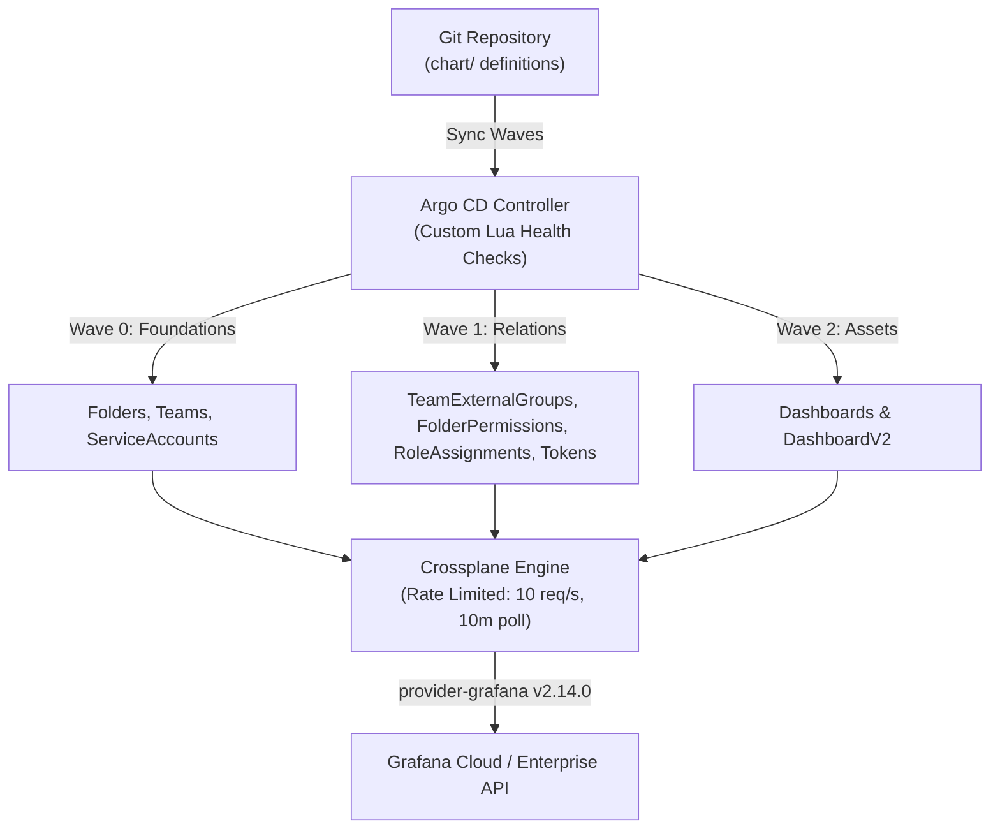

# Grafana GitOps with Crossplane & Argo CD

Declarative, enterprise-grade Grafana Cloud and Grafana Enterprise infrastructure management powered by **Git → Argo CD → Helm → Crossplane (`provider-grafana`)**.

This repository is a fully generic, multi-stack GitOps template. It uses only official Crossplane namespaced v2 managed resources with zero custom controllers, runtime jobs, or out-of-band sweepers.

---

## Table of Contents

1. [Architecture Overview](#architecture-overview)
2. [Step-by-Step Setup Guide](#step-by-step-setup-guide)
3. [Hierarchy & Deletion Policy Matrix](#hierarchy--deletion-policy-matrix)
4. [CLI Short Names Reference](#cli-short-names-reference)
5. [Resource Configuration & Available Options](#resource-configuration--available-options)
   - [Folders](#1-folders)
   - [Teams & IdP Sync](#2-teams--idp-sync)
   - [Service Accounts & Tokens](#3-service-accounts--api-tokens)
   - [Dashboards](#4-dashboards)
   - [RBAC Roles & Presets](#5-rbac-roles--presets)
6. [Multi-Stack Management](#multi-stack-management)
7. [Repository Layout](#repository-layout)

---

## Architecture Overview



### Key Architectural Principles
- **Partial Ownership (Brownfield Coexistence)**: Crossplane reconciles **only** objects explicitly declared in Git. Unmanaged dashboards, folders, teams, tokens, and roles in Grafana Cloud are never touched, deleted, or swept.
- **Safe Parent Preservation**: Parent entities (`Folder`, `Team`, `ServiceAccount`) default to strict **orphan-on-delete** semantics (`managementPolicies: [Observe, Create, Update]`). Removing a manifest from Git removes the Kubernetes Custom Resource (CR) while leaving the live Grafana asset intact.
- **Crossplane v2 Namespaced Resources**: Uses modern namespaced CRD groups (`oss.grafana.m.crossplane.io`, `enterprise.grafana.m.crossplane.io`) with `spec.managementPolicies` (no deprecated `spec.deletionPolicy`).
- **Rate Limit Resilient**: Configured with `DeploymentRuntimeConfig` (`--max-reconcile-rate=10`, `--poll=10m`) to prevent HTTP 429 rate-limiting against Grafana Cloud.

---

## Step-by-Step Setup Guide

Follow these steps in exact order to deploy this GitOps setup for a fresh Grafana stack.

### Step 1: Prerequisites
Ensure you have the following CLI tools installed locally:
- [Helm 3+](https://helm.sh/docs/intro/install/)
- [kubectl](https://kubernetes.io/docs/tasks/tools/)
- [Kind](https://kind.sigs.k8s.io/) (for local cluster) or access to an existing Kubernetes cluster
- [Python 3](https://www.python.org/) with `pyyaml` (for role catalog sync)

### Step 2: Configure Stack Environment Variables
Export your Grafana instance URL and an Admin Service Account Token:
```bash
# Your target Grafana Cloud or Enterprise URL
export GRAFANA_URL="https://<your-org>.grafana.net"

# Grafana Admin Service Account token with Admin privileges
export GRAFANA_TOKEN="glsa_yourAdminServiceAccountTokenHere"

# (Optional) If you forked this repo, specify your remote Git URL
export GIT_REPO_URL="https://github.com/<your-org>/grafana-crossplane.git"
```

### Step 3: Synchronize Roles from Your Live Stack
Grafana Cloud instances have built-in `fixed:*` roles and stack-specific `plugins:*` roles. Fetch and update the catalogs directly from your live instance:
```bash
make sync-roles
```
*This queries `/api/access-control/roles` and populates `chart/catalog/fixed-roles.yaml` and `chart/catalog/stacks/default/plugin-roles.yaml`.*

### Step 4: Bootstrap Infrastructure
Run the automated bootstrap script:
```bash
make bootstrap
# or directly:
./bootstrap.sh
```
What this script does automatically:
1. Creates a Kind cluster named `grafana-admin-gitops` (if not already running).
2. Installs Argo CD and applies custom Lua health checks (`deploy/argocd/argocd-cm.yaml`).
3. Installs Crossplane (`crossplane-stable` Helm chart).
4. Configures `grafana-provider-creds` and sets rate limits (`deploy/crossplane/runtime-config.yaml`).
5. Installs `provider-grafana:v2.14.0` and configures `ProviderConfig/default`.
6. Configures convenient CLI short names (`gfolders`, `gdash`, `gteams`, `gsa`, `gfp`, `gra`, `gteg`).
7. Deploys the Argo CD Application (`deploy/argocd/application.yaml`).

### Step 5: Define Resources in `chart/`
Edit or add your manifests under `chart/`:
- `chart/folders/folders.yaml`: Define folders and hierarchies.
- `chart/teams/*.yaml`: Define teams, IdP sync groups, and RBAC roles.
- `chart/serviceaccounts/serviceaccounts.yaml`: Define service accounts and API tokens.
- `chart/dashboards/<folder-name>/<dashboard>.json`: Place exported Grafana dashboards in subdirectories.

### Step 6: Validate Manifests Locally
Always validate your templates before committing:
```bash
make validate
```
*Runs `helm lint` and `helm template` to ensure zero syntax, reference, or catalog errors.*

### Step 7: Push & Monitor Sync
Commit and push your changes to Git. Argo CD will continuously reconcile your resources:
```bash
git add -A
git commit -m "feat: configure initial stack resources"
git push origin main
```
Monitor the sync in Argo CD:
```bash
# Check Argo CD Application Status
kubectl get application -n argocd grafana-crossplane

# Check all managed Grafana resources using short names
kubectl get gdash,gfolders,gteams,gsa,gfp,gra,gteg -n crossplane-system
```

---

## Hierarchy & Deletion Policy Matrix

| Resource Kind | Level | Sync Wave | Default `managementPolicies` | Deletion Semantics (When removed from Git) | Partial Ownership Protection | Available Overrides |
| :--- | :--- | :---: | :--- | :--- | :--- | :--- |
| **`Folder`** | Parent | `0` | `[Observe, Create, Update]` | **Orphan** (Folder remains intact in Grafana) | `preventDestroyIfNotEmpty: true` hardcoded. Grafana rejects deletion if child objects exist. | `allowDelete: true` |
| **`Team`** | Parent | `0` | `[Observe, Create, Update]` | **Orphan** (Team remains intact in Grafana) | `ignoreExternallySyncedMembers: true` ensures SSO/IdP members are never purged. | N/A (Strict orphan) |
| **`ServiceAccount`** | Parent | `0` | `[Observe, Create, Update]` | **Orphan** (Account remains intact in Grafana) | Active external tokens and integrations using this account remain functional. | N/A (Strict orphan) |
| **`TeamExternalGroup`** | Child | `1` | `[Observe, Create, Update]` | **Orphan** (IdP group links remain in Grafana) | Non-Git IdP groups and manual group links are untouched. | `allowExternalGroupDelete: true` |
| **`FolderPermission`** | Child | `1` | `[Observe, Create, Update, Delete]` | **Delete** (Removes managed permission set) | Folders with no declared permissions emit **no** resource and remain completely untouched. | N/A |
| **`ServiceAccountToken`**| Child | `1` | `[Observe, Create, Update, Delete]` | **Delete** (Token revoked in Grafana) | Unmanaged tokens created in the Grafana UI on the same account are not touched. | N/A |
| **`RoleAssignment`** | Child | `1` | `[Observe, Create, Update, Delete]` | **Update / Delete** (Removes assigned actor) | Only active roles managed (e.g. 41); remaining ~240 native roles are untouched. | N/A |
| **`Dashboard`** | Leaf | `2` | `[Observe, Create, Update, Delete]` | **Delete** (Dashboard deleted from Grafana) | Other dashboards in the same folder are completely unaffected. | N/A |

---

## CLI Short Names Reference

Because Crossplane installs multiple API groups with identical plural names (e.g. `folders.oss.grafana.crossplane.io` vs `folders.oss.grafana.m.crossplane.io`), typing `kubectl get folders` resolves to the legacy empty group. 

We have configured collision-free **short names** on all namespaced CRDs:

| Resource Kind | Short Names | Example Usage |
| :--- | :--- | :--- |
| **Dashboards** | `gdash`, `gdashboard`, `gdashboards` | `kubectl get gdash -n crossplane-system` |
| **Folders** | `gfolder`, `gfolders` | `kubectl get gfolders -n crossplane-system` |
| **Teams** | `gteam`, `gteams` | `kubectl get gteams -n crossplane-system` |
| **Service Accounts** | `gsa`, `gserviceaccounts` | `kubectl get gsa -n crossplane-system` |
| **Folder Permissions** | `gfp`, `gfolderpermissions` | `kubectl get gfp -n crossplane-system` |
| **Role Assignments** | `gra`, `groleassignments` | `kubectl get gra -n crossplane-system` |
| **Team External Groups** | `gteg` | `kubectl get gteg -n crossplane-system` |

### CLI Cheat Sheet
```bash
# Query all managed resources in crossplane-system
kubectl get gdash,gfolders,gteams,gsa,gfp,gra,gteg -n crossplane-system

# Inspect a specific folder and its sync status
kubectl describe gfolder platform -n crossplane-system

# Check generated Service Account tokens and secrets
kubectl get gsa,secret -n crossplane-system
```

---

## Resource Configuration & Available Options

### 1. Folders
Defined in `chart/folders/folders.yaml`:
```yaml
folders:
  # Root folder example
  - uid: platform                      # (Optional) Alphanumeric UID. Slugified from title if omitted.
    title: Platform                    # (Required) Display title in Grafana.
    allowDelete: false                 # (Optional, default: false) Set true to allow deletion when removed from Git.
    permissions:                       # (Optional) Baseline folder permissions for roles.
      - role: Viewer                   # Viewer | Editor | Admin
        permission: View               # View | Edit | Admin

  # Nested folder example
  - uid: observability
    title: Observability
    parentFolderUid: platform          # (Optional) Parent folder UID for folder hierarchies.
    # parentTitle: Platform            # (Optional) Alternative: parent folder title.
    allowDelete: false
```

### 2. Teams & IdP Sync
Each team is defined in its own file under `chart/teams/<team-name>.yaml`:
```yaml
name: SRE                              # (Required) Team display name.
slug: sre                              # (Optional) Kubernetes resource name slug.
email: sre-team@example.com            # (Optional) Team email.

# IdP Group Sync (e.g. Azure AD, Okta, SAML Group UUIDs)
syncGroups:
  - "c8f2fca2-8db2-4876-bce7-d9ea24d1e2e9"

allowExternalGroupDelete: false        # (Optional, default: false) Set true to allow deleting mappings.

# Role Presets (from chart/catalog/role-presets.yaml)
preset: sre                            # or 'presets: [sre, alert-manager]'

# Direct Fixed / Plugin Roles (from chart/catalog/fixed-roles.yaml)
roles:
  - fixed:alerting:admin
  - plugins:grafana-kowalski-app:frontend-observability-viewer

# Team-specific Folder Permissions
folderPermissions:
  - folder: observability              # Target folder UID
    permission: Admin                  # View | Edit | Admin
```

### 3. Service Accounts & API Tokens
Defined in `chart/serviceaccounts/serviceaccounts.yaml`:
```yaml
serviceAccounts:
  - name: ci-deployer                  # (Required) Service account name.
    role: Editor                       # (Required) Basic role: None | Viewer | Editor | Admin.
    isDisabled: false                  # (Optional, default: false) Disable without deleting.
    owner: devops                      # (Optional) Accountability / owner label.
    
    # API Tokens
    tokens:
      - name: ci-deployer-token        # Token display name
        secretName: ci-deployer-token  # Kubernetes Secret where token is saved
        secondsToLive: "90d"           # Lifetime duration: e.g. "30d", "90d", "1y", or seconds
    
    # RBAC Roles
    roles:
      - fixed:dashboards:writer
      - fixed:folders:writer
```

### 4. Dashboards
Dashboards are stored as JSON files under `chart/dashboards/<Folder>/<dashboard>.json`:
- **Automatic Folder Discovery**: Any subdirectory under `chart/dashboards/` is automatically discovered, mapped, and emitted as a managed `Folder` resource if not already defined in `folders.yaml`.
- **Title & UID**: Extracted directly from the dashboard JSON.
- **Overwrites**: Automatically enabled (`overwrite: true`) for GitOps consistency.

### 5. RBAC Roles & Presets
- **Role Presets** (`chart/catalog/role-presets.yaml`): Group common roles into reusable bundles (e.g. `sre`, `dashboard-editor`, `alert-manager`).
- **Fixed Roles** (`chart/catalog/fixed-roles.yaml`): Built-in Grafana Cloud roles.
- **Plugin Roles** (`chart/catalog/stacks/<stack>/plugin-roles.yaml`): Stack-specific plugin roles.

---

## Multi-Stack Management

This repository is designed to be completely decoupled from any single Grafana tenant.

- **Starter Templates (`chart/`)**: Contains minimal, clean starter manifests ready for a new stack.
- **Reference Production Stack (`examples/stacks/osttra/`)**: Contains a full 224-resource production stack (42 folders, 39 teams, 19 service accounts, dashboards).
  
To load the reference Osttra stack into `chart/`:
```bash
cp examples/stacks/osttra/folders/folders.yaml chart/folders/
cp examples/stacks/osttra/teams/*.yaml chart/teams/
cp examples/stacks/osttra/serviceaccounts/serviceaccounts.yaml chart/serviceaccounts/
cp -r examples/stacks/osttra/dashboards/* chart/dashboards/
```
To validate the Osttra reference stack without modifying `chart/`:
```bash
make validate-osttra
```

---

## Repository Layout

```text
├── chart/                               # Helm GitOps Chart
│   ├── catalog/                         # RBAC Role Catalogs
│   │   ├── fixed-roles.yaml             # 152 live fixed:* roles
│   │   ├── role-presets.yaml            # Role preset definitions
│   │   └── stacks/default/plugin-roles.yaml # 129 live plugins:* roles
│   ├── dashboards/                      # Dashboards grouped by Folder
│   │   └── Observability/               # Auto-discovered folder
│   │       └── sample-dashboard.json
│   ├── folders/                         # Folder definitions
│   │   └── folders.yaml
│   ├── serviceaccounts/                 # Service accounts & tokens
│   │   └── serviceaccounts.yaml
│   ├── teams/                           # Team definitions (one per team)
│   │   ├── admins.yaml
│   │   └── sre.yaml
│   ├── templates/                       # Crossplane v2 manifests
│   │   ├── _helpers.tpl                 # RBAC, folder & permission aggregation
│   │   ├── Folder.yaml                  # Folder (Wave 0) & FolderPermission (Wave 1)
│   │   ├── Team.yaml                    # Team (Wave 0) & TeamExternalGroup (Wave 1)
│   │   ├── ServiceAccount.yaml          # ServiceAccount (Wave 0) & Tokens (Wave 1)
│   │   ├── RoleAssignments.yaml         # RoleAssignment (Wave 1)
│   │   └── Dashboard.yaml               # Dashboard (Wave 2)
│   └── values.yaml                      # Chart configuration values
├── deploy/
│   ├── argocd/                          # Argo CD deployment & health checks
│   │   ├── application.yaml             # GitOps Application with ignoreDifferences
│   │   ├── argocd-cm.yaml               # Lua health checks for Crossplane CRDs
│   │   └── project.yaml                 # Argo CD AppProject with whitelisted CRDs
│   └── crossplane/                      # Crossplane runtime & provider config
│       ├── provider.yaml                # provider-grafana:v2.14.0
│       ├── providerconfig.yaml          # ProviderConfig referencing secret
│       └── runtime-config.yaml          # DeploymentRuntimeConfig (rate limits)
├── examples/
│   ├── stacks/
│   │   └── osttra/                      # Full reference production dataset
│   └── ...
├── bootstrap.sh                         # Automated end-to-end setup script
└── Makefile                             # Helper targets (validate, sync-roles, etc.)
```
