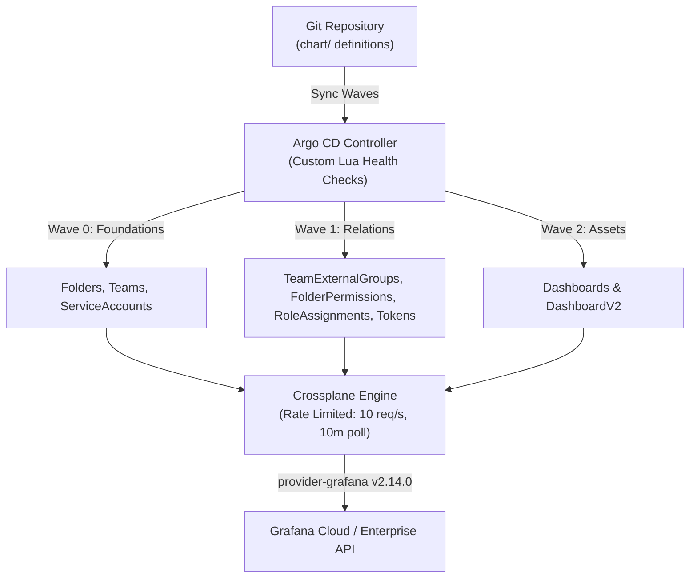

# Grafana GitOps with Crossplane & Argo CD

Declarative, enterprise-grade Grafana Cloud and Grafana Enterprise infrastructure management powered by **Git → Argo CD → Helm → Crossplane (`provider-grafana`)**.

This repository is a fully generic, multi-stack GitOps template. It uses only official Crossplane namespaced v2 managed resources with zero custom controllers, runtime jobs, or out-of-band sweepers.

---

## Table of Contents

1. [Architecture Overview](#architecture-overview)
2. [Step-by-Step Setup Guide](#step-by-step-setup-guide)
3. [Hierarchy & Deletion Policy Matrix](#hierarchy--deletion-policy-matrix)
4. [CLI Short Names Reference](#cli-short-names-reference)
5. [Resource Configuration & Available Options](#resource-configuration--available-options)
   - [Folders](#1-folders)
   - [Teams & IdP Sync](#2-teams--idp-sync)
   - [Service Accounts & Tokens](#3-service-accounts--api-tokens)
   - [Dashboards](#4-dashboards)
   - [RBAC Roles & Presets](#5-rbac-roles--presets)
6. [Multi-Stack Management](#multi-stack-management)
7. [Repository Layout](#repository-layout)

---

## Architecture Overview



### Key Architectural Principles
- **Partial Ownership (Brownfield Coexistence)**: Crossplane reconciles **only** objects explicitly declared in Git. Unmanaged dashboards, folders, teams, tokens, and roles in Grafana Cloud are never touched, deleted, or swept.
- **Safe Parent Preservation**: Parent entities (`Folder`, `Team`, `ServiceAccount`) default to strict **orphan-on-delete** semantics (`managementPolicies: [Observe, Create, Update]`). Removing a manifest from Git removes the Kubernetes Custom Resource (CR) while leaving the live Grafana asset intact.
- **Crossplane v2 Namespaced Resources**: Uses modern namespaced CRD groups (`oss.grafana.m.crossplane.io`, `enterprise.grafana.m.crossplane.io`) with `spec.managementPolicies` (no deprecated `spec.deletionPolicy`).
- **Rate Limit Resilient**: Configured with `DeploymentRuntimeConfig` (`--max-reconcile-rate=10`, `--poll=10m`) to prevent HTTP 429 rate-limiting against Grafana Cloud.

---

## Step-by-Step Setup Guide

Follow these steps in exact order to deploy this GitOps setup for a fresh Grafana stack.

### Step 1: Prerequisites
Ensure you have the following CLI tools installed locally:
- [Helm 3+](https://helm.sh/docs/intro/install/)
- [kubectl](https://kubernetes.io/docs/tasks/tools/)
- [Kind](https://kind.sigs.k8s.io/) (for local cluster) or access to an existing Kubernetes cluster
- [Python 3](https://www.python.org/) with `pyyaml` (for role catalog sync)

### Step 2: Configure Stack Environment Variables
Export your Grafana instance URL and an Admin Service Account Token:
```bash
# Your target Grafana Cloud or Enterprise URL
export GRAFANA_URL="https://<your-org>.grafana.net"

# Grafana Admin Service Account token with Admin privileges
export GRAFANA_TOKEN="glsa_yourAdminServiceAccountTokenHere"

# (Optional) If you forked this repo, specify your remote Git URL
export GIT_REPO_URL="https://github.com/<your-org>/grafana-crossplane.git"
```

### Step 3: Synchronize Roles from Your Live Stack
Grafana Cloud instances have built-in `fixed:*` roles and stack-specific `plugins:*` roles. Fetch and update the catalogs directly from your live instance:
```bash
make sync-roles
```
*This queries `/api/access-control/roles` and populates `chart/catalog/fixed-roles.yaml` and `chart/catalog/stacks/default/plugin-roles.yaml`.*

### Step 4: Bootstrap Infrastructure
Run the automated bootstrap script:
```bash
make bootstrap
# or directly:
./bootstrap.sh
```
What this script does automatically:
1. Creates a Kind cluster named `grafana-admin-gitops` (if not already running).
2. Installs Argo CD and applies custom Lua health checks (`deploy/argocd/argocd-cm.yaml`).
3. Installs Crossplane (`crossplane-stable` Helm chart).
4. Configures `grafana-provider-creds` and sets rate limits (`deploy/crossplane/runtime-config.yaml`).
5. Installs `provider-grafana:v2.14.0` and configures `ProviderConfig/default`.
6. Configures convenient CLI short names (`gfolders`, `gdash`, `gteams`, `gsa`, `gfp`, `gra`, `gteg`).
7. Deploys the Argo CD Application (`deploy/argocd/application.yaml`).

### Step 5: Define Resources in `chart/`
Edit or add your manifests under `chart/`:
- `chart/folders/folders.yaml`: Define folders and hierarchies.
- `chart/teams/*.yaml`: Define teams, IdP sync groups, and RBAC roles.
- `chart/serviceaccounts/serviceaccounts.yaml`: Define service accounts and API tokens.
- `chart/dashboards/<folder-name>/<dashboard>.json`: Place exported Grafana dashboards in subdirectories.

### Step 6: Validate Manifests Locally
Always validate your templates before committing:
```bash
make validate
```
*Runs `helm lint` and `helm template` to ensure zero syntax, reference, or catalog errors.*

### Step 7: Push & Monitor Sync
Commit and push your changes to Git. Argo CD will continuously reconcile your resources:
```bash
git add -A
git commit -m "feat: configure initial stack resources"
git push origin main
```
Monitor the sync in Argo CD:
```bash
# Check Argo CD Application Status
kubectl get application -n argocd grafana-crossplane

# Check all managed Grafana resources using short names
kubectl get gdash,gfolders,gteams,gsa,gfp,gra,gteg -n crossplane-system
```

---

## Hierarchy & Deletion Policy Matrix

## Built-in Safety Model (Zero Boilerplate)

To keep your production resources completely safe without requiring confusing boilerplate flags in every YAML file, safety is built directly into the templates:

1. **Parent Resources are Always Safe (Orphan on Delete)**:
   - **`Folder`**, **`Team`**, and **`ServiceAccount`** resources are parents. They **never delete** the external Grafana object when removed from Git. Crossplane simply deletes the Kubernetes CR and leaves the Grafana asset intact.
   - You **do not** need to write `allowDelete: false` or `allowExternalGroupDelete: false`.
2. **Team Members are Never Touched (`ignoreExternallySyncedMembers: true`)**:
   - `ignoreExternallySyncedMembers: true` is hardcoded into `Team.yaml`. Users added via Okta, Azure AD, SAML, or the Grafana UI will **never** be purged by Crossplane.
3. **Folders are Protected from Accidental Destruction (`preventDestroyIfNotEmpty: true`)**:
   - `preventDestroyIfNotEmpty: true` is hardcoded into `Folder.yaml`, ensuring that folders containing dashboards, alerts, or subfolders can never be accidentally destroyed.
4. **Leaf Resources are Safely Pruned**:
   - **`Dashboard`** and **`ServiceAccountToken`** are leaf resources. When you remove a dashboard JSON file or a token entry from Git, only that specific asset or token is deleted/revoked in Grafana.

---

## Resource Lifecycle Matrix

| Resource Kind | Resource Type | Sync Wave | Deletion Behavior (When removed from Git) | Built-in Safety Protection |
| :--- | :--- | :---: | :--- | :--- |
| **`Folder`** | Parent | `0` | **Orphan** (Folder remains intact in Grafana) | `preventDestroyIfNotEmpty: true` built-in. Grafana blocks deletion if contents exist. |
| **`Team`** | Parent | `0` | **Orphan** (Team remains intact in Grafana) | `ignoreExternallySyncedMembers: true` built-in. IdP/SSO members are never touched. |
| **`ServiceAccount`** | Parent | `0` | **Orphan** (Account remains intact in Grafana) | Active external tokens and integrations remain operational. |
| **`TeamExternalGroup`** | Child | `1` | **Orphan** (IdP group links remain in Grafana) | Non-Git IdP groups and manual group links are untouched. |
| **`FolderPermission`** | Child | `1` | **Delete** (Removes managed permission set) | Folders with no declared permissions emit **no** resource and remain completely untouched. |
| **`ServiceAccountToken`**| Child | `1` | **Delete** (Token revoked in Grafana) | Unmanaged tokens created in the Grafana UI on the same account are not touched. |
| **`RoleAssignment`** | Child | `1` | **Update / Delete** (Removes assigned actor) | Only active roles managed (e.g. 41); remaining ~240 native roles are untouched. |
| **`Dashboard`** | Leaf | `2` | **Delete** (Dashboard deleted from Grafana) | Other dashboards in the same folder are completely unaffected. |

---

## CLI Short Names Reference

Because Crossplane installs multiple API groups with identical plural names (e.g. `folders.oss.grafana.crossplane.io` vs `folders.oss.grafana.m.crossplane.io`), typing `kubectl get folders` resolves to the legacy empty group. 

We have configured collision-free **short names** on all namespaced CRDs:

| Resource Kind | Short Names | Example Usage |
| :--- | :--- | :--- |
| **Dashboards** | `gdash`, `gdashboard`, `gdashboards` | `kubectl get gdash -n crossplane-system` |
| **Folders** | `gfolder`, `gfolders` | `kubectl get gfolders -n crossplane-system` |
| **Teams** | `gteam`, `gteams` | `kubectl get gteams -n crossplane-system` |
| **Service Accounts** | `gsa`, `gserviceaccounts` | `kubectl get gsa -n crossplane-system` |
| **Folder Permissions** | `gfp`, `gfolderpermissions` | `kubectl get gfp -n crossplane-system` |
| **Role Assignments** | `gra`, `groleassignments` | `kubectl get gra -n crossplane-system` |
| **Team External Groups** | `gteg` | `kubectl get gteg -n crossplane-system` |

### CLI Cheat Sheet
```bash
# Query all managed resources in crossplane-system
kubectl get gdash,gfolders,gteams,gsa,gfp,gra,gteg -n crossplane-system

# Inspect a specific folder and its sync status
kubectl describe gfolder platform -n crossplane-system

# Check generated Service Account tokens and secrets
kubectl get gsa,secret -n crossplane-system
```

## Unified Resource Configuration (All-in-One Definitions)

All identity, access control, RBAC roles, presets, and folder permissions are defined **directly on the resource itself**. You do not need to manage disconnected RBAC binding files.

### 1. Folders
Defined in `chart/folders/folders.yaml`:
```yaml
folders:
  # Root folder (UID is automatically slugified from title -> "platform")
  - title: Platform                    # (Required) Display title in Grafana.
    permissions:                       # (Optional) Baseline folder permissions.
      - role: Viewer                   # Viewer | Editor | Admin
        permission: View               # View | Edit | Admin

  # Nested folder
  - title: Observability               # UID automatically becomes "observability"
    parentFolderUid: platform          # (Optional) Parent folder UID or parentTitle for nesting.

  # (Optional) Existing Brownfield Folder:
  # If linking to an existing Grafana folder that already has a random UID, provide uid:
  # - uid: cde12345
  #   title: Legacy Reports
```

### 2. Teams (All-in-One Team Manifest)
Each team is defined in its own file under `chart/teams/<team-name>.yaml`. All memberships, presets, roles, and folder permissions live together:
```yaml
name: SRE                              # (Required) Team display name.
email: sre-team@example.com            # (Optional) Team email.

# IdP Group Sync (Azure AD, Okta, SAML Group UUIDs)
syncGroups:
  - "c8f2fca2-8db2-4876-bce7-d9ea24d1e2e9"

# Role Preset (from chart/catalog/role-presets.yaml)
preset: sre                            # or 'presets: [sre, alert-manager]'

# Direct Fixed / Plugin RBAC Roles (from chart/catalog/)
roles:
  - fixed:alerting:admin
  - plugins:grafana-kowalski-app:frontend-observability-viewer

# Folder Permissions granted to this team
folderPermissions:
  - folder: observability              # Matches folder UID or title
    permission: Admin                  # View | Edit | Admin

# Label-Based Access Control (LBAC) on dedicated datasources
lbac:
  - datasourceUid: efwdhsqoszbb4f      # Dedicated LBAC datasource (e.g. logs-lbac)
    permission: Query                  # (Optional, default: Query) Grants query access
    rules:                             # LogQL or PromQL label matchers
      - '{cluster="prod", namespace="sre"}'
      - '{env="prod", job="node-exporter"}'
```


### 3. Service Accounts & API Tokens (All-in-One Definition)
Defined in `chart/serviceaccounts/serviceaccounts.yaml`. All tokens, roles, and presets live together:
```yaml
serviceAccounts:
  - name: ci-deployer                  # (Required) Service account name. (resourceName is NOT needed)
    role: Editor                       # (Required) Basic role: None | Viewer | Editor | Admin.
                                       # Set to "None" or "Viewer" if using fine-grained roles below.
    isDisabled: false                  # (Optional, default: false) Disable without deleting.
    owner: devops                      # (Optional) Team or owner accountability label.
    
    # API Tokens
    tokens:
      - name: ci-deployer-token        # Token display name
        secretName: ci-deployer-token  # Kubernetes Secret where token is saved
        secondsToLive: "90d"           # Lifetime duration: "30d", "90d", "1y", or seconds
    
    # Fine-grained RBAC Roles (optional, preset or direct)
    roles:
      - fixed:dashboards:writer
      - fixed:folders:writer
```

### 4. Dashboards
Dashboards are stored as JSON files under `chart/dashboards/<Folder>/<dashboard>.json`:
- **Automatic Folder Discovery**: Any subdirectory under `chart/dashboards/` is automatically discovered, mapped, and emitted as a managed `Folder` resource if not already defined in `folders.yaml`.
- **Title & UID**: Extracted directly from the dashboard JSON.
- **Overwrites**: Automatically enabled (`overwrite: true`) for GitOps consistency.


### 5. Label-Based Access Control (LBAC)
For teams searching logs or metrics in the Grafana UI on a dedicated LBAC data source (e.g. `grafanacloud-logs-lbac`), providing access requires two steps:
1. **Query Permission**: Allowing the team to query the data source.
2. **Label Filtering**: Attaching LogQL or PromQL label filters to that team on that data source.

Both steps are declared together directly inside the team manifest (`chart/teams/<team>.yaml`):
```yaml
lbac:
  - datasourceUid: efwdhsqoszbb4f      # Target dedicated LBAC datasource UID
    permission: Query                  # (Optional, default: Query)
    rules:
      - '{cluster="prod", namespace="sre"}'
```

#### Safe Merge & Override Architecture:
- **`chart/catalog/baseline-lbac.yaml`**: Stores pre-existing rules for teams on live data sources so they are not wiped out by whole-set `PUT` updates.
- **Merge / Override**: If a team exists in `baseline-lbac.yaml` and is also declared in `chart/teams/<team>.yaml`, the team manifest in Git **merges and overrides** the baseline rules.
- **Preservation**: Any teams defined in `baseline-lbac.yaml` that are not yet in `chart/teams/` are **automatically preserved**.
- **Day 0 Import**: To snapshot pre-existing LBAC rules from live Grafana into the baseline catalog:
  ```bash
  make import-lbac
  ```

---


## Multi-Stack & Blank Canvas Architecture

This repository is intentionally designed to start from a **completely blank slate** for any new Grafana stack:

- **Empty `chart/` Resources**: By default, `chart/folders/folders.yaml` and `chart/serviceaccounts/serviceaccounts.yaml` contain empty lists (`[]`), and `chart/teams/` and `chart/dashboards/` contain only `.gitkeep`.
- **Rich Examples in `examples/`**: Full, production-ready examples are provided in `examples/folders/`, `examples/teams/`, `examples/serviceaccounts/`, and `examples/dashboards/`.

### Will an Empty Chart Delete Anything from an Existing Grafana Stack?

> [!IMPORTANT]
> **NO. It is 100% safe.**
> 
> If you deploy this repository with a blank `chart/` against a new or existing Grafana stack:
> 1. **Zero CRs Rendered**: Helm emits 0 Custom Resources to Kubernetes.
> 2. **No Discovery Sweepers**: Crossplane controllers only reconcile Kubernetes CRs that actively exist in the cluster. Crossplane has **no discovery sweeps** or global garbage collection.
> 3. **Partial Ownership Preserved**: Any folders, dashboards, teams, users, or permissions that already exist in the target Grafana instance are completely invisible to Crossplane and remain **100% untouched**.
> 4. **Parent Orphan Protection**: Even when resources *were* previously managed by Git and are subsequently removed, parent resources (`Folder`, `Team`, `ServiceAccount`) default to strict orphan-on-delete (`[Observe, Create, Update]`), guaranteeing they are never deleted from Grafana.

### Starting a New Stack
To start managing resources on a new stack:
1. Copy example manifests from `examples/` into `chart/`:
   ```bash
   # Copy folder examples
   cp examples/folders/folders.yaml chart/folders/
   
   # Copy team examples
   cp examples/teams/admins.yaml chart/teams/
   cp examples/teams/sre.yaml chart/teams/
   
   # Copy service account examples
   cp examples/serviceaccounts/serviceaccounts.yaml chart/serviceaccounts/
   
   # Copy sample dashboard
   mkdir -p chart/dashboards/Observability
   cp examples/dashboards/sample-dashboard.json chart/dashboards/Observability/
   ```
2. Customize the values for your stack.
3. Validate locally:
   ```bash
   make validate
   ```
4. Commit and push to Git.

---

## Repository Layout

```text
├── chart/                               # Helm GitOps Chart (Blank canvas by default)
│   ├── catalog/                         # RBAC Role Catalogs
│   │   ├── fixed-roles.yaml             # 152 live fixed:* roles
│   │   ├── role-presets.yaml            # Role preset definitions
│   │   └── stacks/default/plugin-roles.yaml # 129 live plugins:* roles
│   ├── dashboards/                      # Dashboards grouped by Folder (.gitkeep)
│   ├── folders/                         # Folder definitions (folders.yaml: [])
│   ├── serviceaccounts/                 # Service accounts & tokens (serviceaccounts.yaml: [])
│   ├── teams/                           # Team definitions (.gitkeep)
│   ├── templates/                       # Crossplane v2 manifests
│   │   ├── _helpers.tpl                 # RBAC, folder & permission aggregation
│   │   ├── Folder.yaml                  # Folder (Wave 0) & FolderPermission (Wave 1)
│   │   ├── Team.yaml                    # Team (Wave 0) & TeamExternalGroup (Wave 1)
│   │   ├── ServiceAccount.yaml          # ServiceAccount (Wave 0) & Tokens (Wave 1)
│   │   ├── RoleAssignments.yaml         # RoleAssignment (Wave 1)
│   │   └── Dashboard.yaml               # Dashboard (Wave 2)
│   └── values.yaml                      # Chart configuration values
├── deploy/
│   ├── argocd/                          # Argo CD deployment & health checks
│   │   ├── application.yaml             # GitOps Application with ignoreDifferences
│   │   ├── argocd-cm.yaml               # Lua health checks for Crossplane CRDs
│   │   └── project.yaml                 # Argo CD AppProject with whitelisted CRDs
│   └── crossplane/                      # Crossplane runtime & provider config
│       ├── provider.yaml                # provider-grafana:v2.14.0
│       ├── providerconfig.yaml          # ProviderConfig referencing secret
│       └── runtime-config.yaml          # DeploymentRuntimeConfig (rate limits)
├── examples/                            # Comprehensive reference examples
│   ├── dashboards/                      # Example dashboards
│   ├── folders/                         # Example folder configurations
│   ├── rbac/                            # Example RBAC role bindings
│   ├── serviceaccounts/                 # Example service accounts & tokens
│   └── teams/                           # Example teams & IdP sync groups
├── bootstrap.sh                         # Automated end-to-end setup script
└── Makefile                             # Helper targets (validate, sync-roles, etc.)
```

